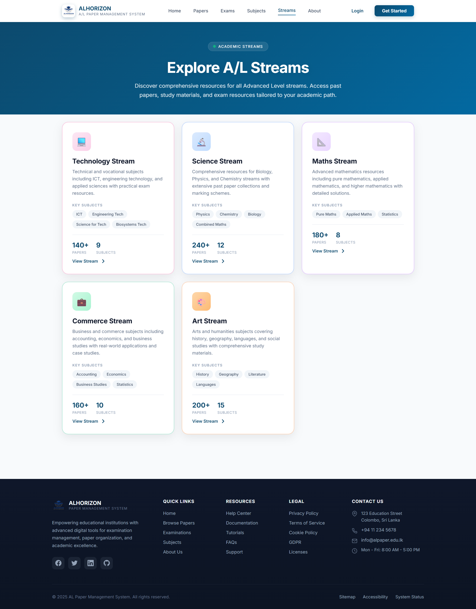

# 🧾 ALHORIZON | A/L Paper Management System | DEA Assignment

<div align="center">
  
  <!-- Add your project logo here -->
  
  
  [](https://spring.io/projects/spring-boot)
  [](https://www.oracle.com/java/)
  [](https://www.mysql.com/)

  **An efficient Spring Boot web application designed to organize and manage Advanced Level past papers and model papers**

  [Features](#-key-features) • [Setup](#-installation--setup) • [Usage](#-usage-guide) • [API Documentation](#-api-documentation) • [Contributors](#-contributors)

</div>

---

## 📋 Table of Contents

- [Overview](#-overview)
- [Key Features](#-key-features)
- [Technology Stack](#-technology-stack)
- [System Architecture](#-system-architecture)
- [Dependencies & Plugins](#-dependencies--plugins)
- [Installation & Setup](#-installation--setup)
- [Usage Guide](#-usage-guide)
- [API Documentation](#-api-documentation)
- [Screenshots](#-screenshots)
- [Contributors](#-contributors)

---

## 🎯 Overview

**ALHORIZON** is a secure, scalable web-based platform designed to streamline the organization, distribution, and management of Advanced Level educational materials. Developed as part of the Distributed Enterprise Applications (DEA) assignment, this system provides role-based access control, enabling administrators, teachers, and students to interact with academic resources efficiently.

Built with modern enterprise Java technologies, ALHORIZON offers both a user-friendly web interface powered by Thymeleaf and a comprehensive RESTful API for seamless integration with external applications.

---

## 🚀 Key Features

### 👨‍💼 Administrator Features
- **Content Management**: Upload, organize, and manage academic papers with comprehensive metadata
- **Subject Administration**: Create and manage subject categories across multiple academic streams
- **User Management**: Control user access and permissions
- **Content Moderation**: Review, approve, and remove papers as needed
- **Analytics Dashboard**: Monitor system usage and content statistics
- **Bulk Operations**: Perform batch uploads and deletions efficiently

### 👨‍🏫 Teacher Features
- **Paper Upload**: Submit past papers, model papers, and revision materials
- **Resource Organization**: Categorize papers by subject, year, and type
- **Content Updates**: Edit and update existing paper metadata
- **Student Support**: Provide curated study materials for specific subjects

### 👨‍🎓 Student Features
- **Advanced Search**: Filter papers by subject, year, stream, and paper type
- **Easy Downloads**: Direct PDF downloads with single-click access
- **Categorized Browsing**: Navigate content by academic streams (Technology, Science, Commerce, Arts)
- **Responsive Interface**: Seamless experience across desktop and mobile devices

### ⚙️ System Features
- **Secure File Storage**: Local file system storage with configurable paths (`uploads/papers/`)
- **Role-Based Access Control (RBAC)**: Granular permissions for Admin, Teacher, and Student roles
- **RESTful API**: Comprehensive JSON API for third-party integrations
- **Pagination & Filtering**: Efficient data retrieval with customizable page sizes
- **CSRF Protection**: Secure forms with CSRF tokens (API endpoints exempted for integration)
- **Password Encryption**: BCrypt hashing for secure credential storage
- **Audit Logging**: Track all system activities for security and compliance
- **Modular Architecture**: Clean separation of concerns (`auth`, `papers`, `subjects`, `config`)

---

## 🛠 Technology Stack

| Layer | Technology | Version | Purpose |
|-------|------------|---------|---------|
| **Backend Framework** | Spring Boot | 3.x | Core application framework |
| **View Layer** | Thymeleaf | 3.1+ | Server-side template engine |
| **Database** | MySQL | 8.0+ | Relational data persistence |
| **ORM** | Hibernate/JPA | 6.x | Object-relational mapping |
| **Security** | Spring Security | 6.x | Authentication & authorization |
| **Frontend** | HTML5, CSS3, Bootstrap | 5.x | Responsive UI design |
| **Scripting** | JavaScript (ES6+) | - | Client-side interactivity |
| **File Handling** | Spring Multipart | - | PDF upload management |
| **Build Tool** | Maven | 3.8+ | Dependency management |
| **Java Runtime** | JDK | 17+ | Application runtime |
| **API Testing** | Postman | Latest | API development & testing |

---

## 🏗 System Architecture

```
┌─────────────────────────────────────────────────────────────┐
│                      Presentation Layer                      │
│  ┌──────────────┐  ┌──────────────┐  ┌─────────────────┐   │
│  │  Thymeleaf   │  │   Bootstrap  │  │   JavaScript    │   │
│  │   Templates  │  │   CSS/UI     │  │    Client       │   │
│  └──────────────┘  └──────────────┘  └─────────────────┘   │
└─────────────────────────────────────────────────────────────┘
                            ▼
┌─────────────────────────────────────────────────────────────┐
│                     Application Layer                        │
│  ┌──────────────┐  ┌──────────────┐  ┌─────────────────┐   │
│  │ Spring MVC   │  │   REST API   │  │  Spring         │   │
│  │ Controllers  │  │  Controllers │  │  Security       │   │
│  └──────────────┘  └──────────────┘  └─────────────────┘   │
└─────────────────────────────────────────────────────────────┘
                            ▼
┌─────────────────────────────────────────────────────────────┐
│                      Business Layer                          │
│  ┌──────────────┐  ┌──────────────┐  ┌─────────────────┐   │
│  │   Service    │  │  Validation  │  │   Business      │   │
│  │    Layer     │  │    Logic     │  │    Rules        │   │
│  └──────────────┘  └──────────────┘  └─────────────────┘   │
└─────────────────────────────────────────────────────────────┘
                            ▼
┌─────────────────────────────────────────────────────────────┐
│                    Data Access Layer                         │
│  ┌──────────────┐  ┌──────────────┐  ┌─────────────────┐   │
│  │ JPA/Hibernate│  │  Repository  │  │   Entity        │   │
│  │   (ORM)      │  │  Interfaces  │  │   Models        │   │
│  └──────────────┘  └──────────────┘  └─────────────────┘   │
└─────────────────────────────────────────────────────────────┘
                            ▼
┌─────────────────────────────────────────────────────────────┐
│                      Persistence Layer                       │
│              MySQL Database + File System                    │
└─────────────────────────────────────────────────────────────┘
```

---

## 📦 Dependencies & Plugins

### Maven Dependencies

The project uses the following core dependencies defined in `pom.xml`:

```xml
<dependencies>
    <!-- Spring Boot Starters -->
    <dependency>
       <groupId>org.springframework.boot</groupId>
       <artifactId>spring-boot-starter-data-jpa</artifactId>
    </dependency>
    <dependency>
       <groupId>org.springframework.boot</groupId>
       <artifactId>spring-boot-starter-security</artifactId>
    </dependency>
    <dependency>
       <groupId>org.springframework.boot</groupId>
       <artifactId>spring-boot-starter-thymeleaf</artifactId>
    </dependency>
    <dependency>
       <groupId>org.springframework.boot</groupId>
       <artifactId>spring-boot-starter-validation</artifactId>
    </dependency>
    <dependency>
       <groupId>org.springframework.boot</groupId>
       <artifactId>spring-boot-starter-web</artifactId>
    </dependency>
    
    <!-- Thymeleaf Security Integration -->
    <dependency>
       <groupId>org.thymeleaf.extras</groupId>
       <artifactId>thymeleaf-extras-springsecurity6</artifactId>
    </dependency>

    <!-- Development Tools -->
    <dependency>
       <groupId>org.springframework.boot</groupId>
       <artifactId>spring-boot-devtools</artifactId>
       <scope>runtime</scope>
       <optional>true</optional>
    </dependency>
    
    <!-- Database Driver -->
    <dependency>
       <groupId>com.mysql</groupId>
       <artifactId>mysql-connector-j</artifactId>
       <scope>runtime</scope>
    </dependency>
    
    <!-- Code Generation -->
    <dependency>
       <groupId>org.projectlombok</groupId>
       <artifactId>lombok</artifactId>
       <optional>true</optional>
    </dependency>
    
    <!-- Testing -->
    <dependency>
       <groupId>org.springframework.boot</groupId>
       <artifactId>spring-boot-starter-test</artifactId>
       <scope>test</scope>
    </dependency>
    <dependency>
       <groupId>org.springframework.security</groupId>
       <artifactId>spring-security-test</artifactId>
       <scope>test</scope>
    </dependency>
</dependencies>
```

### Maven Build Plugins

```xml
<build>
    <plugins>
        <plugin>
            <groupId>org.springframework.boot</groupId>
            <artifactId>spring-boot-maven-plugin</artifactId>
            <configuration>
                <excludes>
                    <exclude>
                        <groupId>org.projectlombok</groupId>
                        <artifactId>lombok</artifactId>
                    </exclude>
                </excludes>
            </configuration>
        </plugin>
    </plugins>
</build>
```

### Dependency Overview

| Dependency | Purpose |
|------------|---------|
| **spring-boot-starter-data-jpa** | JPA/Hibernate for database operations |
| **spring-boot-starter-security** | Authentication & authorization |
| **spring-boot-starter-thymeleaf** | Server-side template engine |
| **spring-boot-starter-validation** | Bean validation (JSR-380) |
| **spring-boot-starter-web** | RESTful web services & MVC |
| **thymeleaf-extras-springsecurity6** | Security tags in Thymeleaf templates |
| **spring-boot-devtools** | Hot reload during development |
| **mysql-connector-j** | MySQL JDBC driver |
| **lombok** | Reduce boilerplate code |
| **spring-boot-starter-test** | JUnit, Mockito, AssertJ testing |
| **spring-security-test** | Security-specific testing utilities |

---

## 📥 Installation & Setup

### 📋 Prerequisites

Before you begin, ensure you have the following installed on your system:

- **Java Development Kit (JDK)**: Version 17 or higher
  ```bash
  java -version  # Verify installation
  ```
- **Apache Maven**: Version 3.8 or higher
  ```bash
  mvn -version   # Verify installation
  ```
- **MySQL Server**: Version 8.0 or higher (running on `localhost:3306`)
- **Git**: For version control
- **IDE** (Optional): IntelliJ IDEA, Eclipse, or VS Code with Java extensions
- **Postman** (Optional): For API testing and development

### 🔧 Step-by-Step Setup Guide

#### 1️⃣ Clone the Repository

```bash
# Clone the repository
git clone https://github.com/your-username/al-paper-management.git

# Navigate to project directory
cd al-paper-management
```

#### 2️⃣ Database Configuration

```bash
# Login to MySQL
mysql -u root -p

# Create database
CREATE DATABASE alpms_db CHARACTER SET utf8mb4 COLLATE utf8mb4_unicode_ci;

# Create database user (optional but recommended)
CREATE USER 'alpms_user'@'localhost' IDENTIFIED BY 'your_secure_password';
GRANT ALL PRIVILEGES ON alpms_db.* TO 'alpms_user'@'localhost';
FLUSH PRIVILEGES;

# Exit MySQL
EXIT;
```

#### 3️⃣ Configure Application Properties

Create or update `src/main/resources/application.properties`:

```properties
# Database Configuration
spring.datasource.url=jdbc:mysql://localhost:3306/alpms_db?useSSL=false&serverTimezone=UTC
spring.datasource.username=alpms_user
spring.datasource.password=your_secure_password
spring.datasource.driver-class-name=com.mysql.cj.jdbc.Driver

# JPA/Hibernate Configuration
spring.jpa.hibernate.ddl-auto=update
spring.jpa.show-sql=true
spring.jpa.properties.hibernate.dialect=org.hibernate.dialect.MySQL8Dialect
spring.jpa.properties.hibernate.format_sql=true

# File Upload Configuration
spring.servlet.multipart.max-file-size=50MB
spring.servlet.multipart.max-request-size=50MB
spring.servlet.multipart.enabled=true

# File Storage Path
app.upload.dir=uploads/papers/

# Server Configuration
server.port=8080
server.error.include-message=always

# Thymeleaf Configuration
spring.thymeleaf.cache=false
spring.thymeleaf.prefix=classpath:/templates/
spring.thymeleaf.suffix=.html

# Logging Configuration
logging.level.com.alpms=DEBUG
logging.level.org.springframework.web=INFO
logging.level.org.hibernate=INFO
```

#### 4️⃣ Create Upload Directory

```bash
# Create directory for storing uploaded papers
mkdir -p uploads/papers

# Verify directory exists
ls -la uploads/
```

#### 5️⃣ Build the Project

```bash
# Clean and build the project
mvn clean install

# Skip tests if needed (not recommended for production)
mvn clean install -DskipTests
```

#### 6️⃣ Run the Application

```bash
# Method 1: Using Maven
mvn spring-boot:run

# Method 2: Using Java JAR
java -jar target/alpms-1.0.0.jar

# Method 3: Using IDE
# Run the main application class: AlPaperManagementApplication.java
```

#### 7️⃣ Verify Installation

Open your browser and navigate to:
- **Web Interface**: http://localhost:8080
- **API Base URL**: http://localhost:8080/api
- **Health Check**: http://localhost:8080/actuator/health (if actuator is configured)

Default login credentials:
- **Email**: `admin@gmail.com`
- **Password**: `admin123`

⚠️ **Important**: Change the default admin password immediately after first login!


### 🔍 Troubleshooting

| Issue | Solution |
|-------|----------|
| Port 8080 already in use | Change port in `application.yml` or kill existing process |
| Database connection failed | Verify MySQL is running and credentials are correct |
| File upload fails | Check directory permissions: `chmod 755 uploads/papers/` |
| Build errors | Ensure Java 17+ and Maven 3.8+ are installed |
| Lombok not working | Enable annotation processing in your IDE |

---

## 📖 Usage Guide

### 👨‍💼 Administrator Workflow

1. **Login** with admin credentials
2. Navigate to **Admin Dashboard**
3. **Manage Subjects**: Add/Edit subject categories
4. **Upload Papers**: Click "Upload New Paper" and fill metadata
5. **Moderate Content**: Review teacher submissions
6. **Manage Users**: Add teachers and approve accounts

### 👨‍🏫 Teacher Workflow

1. **Register** or receive account from admin
2. **Login** to teacher portal
3. **Upload Papers**: Select subject, year, and upload PDF
4. **Edit Metadata**: Update paper titles and descriptions
5. **Track Submissions**: View upload history and status

### 👨‍🎓 Student Workflow

1. **Browse** papers by subject or stream
2. **Filter** by year and paper type
3. **Download** PDFs with one click
4. **Search** using keywords

---

## 📡 API Documentation

### Authentication Endpoints

```http
POST /api/auth/login
POST /api/auth/register
POST /api/auth/logout
```

### Paper Management Endpoints

```http
GET    /api/papers              # List all papers (paginated)
GET    /api/papers/{id}         # Get paper details
POST   /api/papers              # Upload new paper (Teacher/Admin)
PUT    /api/papers/{id}         # Update paper (Teacher/Admin)
DELETE /api/papers/{id}         # Delete paper (Admin)
GET    /api/papers/subject/{id} # Filter by subject
GET    /api/papers/year/{year}  # Filter by year
```

### Example Request (Postman)

```json
POST /api/papers
Content-Type: multipart/form-data

{
  "title": "2023 Physics Paper",
  "year": 2023,
  "subjectId": 2,
  "paperType": "PAST",
  "file": <binary>
}
```


## Screenshots

### 1️⃣ Landing Page  
  
*Homepage showcasing featured papers and quick navigation*

---

### 2️⃣ Admin Dashboard  

*Comprehensive admin panel for content and user management*

---

### 3️⃣ Admin Profile  
 
*Admin personal dashboard with account and management options*

---

### 4️⃣ Teacher Profile  
  
*Dedicated teacher profile displaying uploaded papers and stats*

---

### 5️⃣ Student Profile  
  
*Personalized student profile showing downloaded papers and preferences*

---

### 6️⃣ Stream Page  
  
*Displays categorized paper streams for easy subject selection*

---

### 6️⃣ Subjects Details View  
  
*Overview of subjects and categorized paper listings*

---

### 7️⃣ Paper Details View  
 
*Detailed information page for each paper with download and preview options*

---

### 9️⃣ Paper Download Page  
  
*Clean and simple interface to download selected past or model papers*

---

### 8️⃣ Upload Interface  
  
*Simple and intuitive upload form for teachers to submit papers*

---

### 9️⃣ Mobile Responsive View  
  
*Fully responsive design optimized for smartphones and tablets*

## 👥 Contributors

<table>
  <tr>
    <td align="center">
      <a href="https://github.com/sasundibinara">
        <br />
        <sub><b>N P A Sasundi</b></sub>
      </a><br />
    </td>
    <td align="center">
      <a href="https://github.com/dunalanjula">
        <br />
        <sub><b>M D A Janadara</b></sub>
      </a><br />
    </td>
    <td align="center">
      <a href="https://github.com/chalajayalakshi">
        <br />
        <sub><b>J C jayalakshi</b></sub>
      </a><br />
    </td>
    <td align="center">
      <a href="https://github.com/shayaruni">
        <br />
        <sub><b>W M S S Wijekoon</b></sub>
      </a><br />
    </td>
        <td align="center">
      <a href="https://github.com/resandiwork">
        <br />
        <sub><b>I G R M Dharmappriya</b></sub>
      </a><br />
    </td>
  </tr>
</table>


## 📞 Support & Contact

- **Issues**: [GitHub Issues](https://github.com/your-username/al-paper-management/issues)
- **Email**: support@alhorizon.edu
- **Documentation**: [Wiki](https://github.com/your-username/al-paper-management/wiki)

---

## 🙏 Acknowledgments

- Spring Boot community for excellent documentation
- Bootstrap team for responsive UI components
- All contributors who helped shape this project
- Distributed Enterprise Applications (DEA) course instructors and mentors

---

<div align="center">
  
  **Made with ❤️ by the ALHORIZON Team**
  
  ⭐ Star this repository if you find it helpful!

</div>
